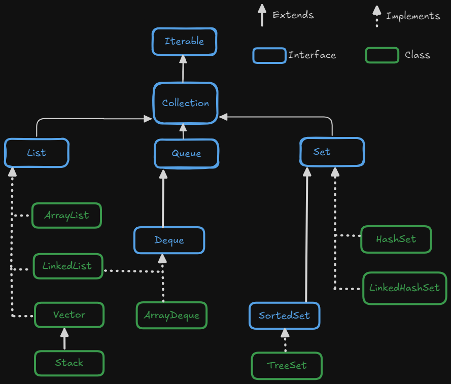

# Collections

* **Collection** represents group of individual objects as a single enitiy.

* **Collection Framework** : It contains several classes and interfaces which can be used to represent group of individual objects as single entity.

* **Collection Framework Interfaces and Classes**

    

    - *Collection (I)* : If we want to  represents group of individual objects as a single enitiy.

        - It defines most common methods which are applicable for any collection object.
        - In general collection interface is considered as root interface of collection framework.

    
    - Collection vs Collections
        * In Java, `Collection` and `Collections` are two distinct terms that are often confused.

        | `Collection`                                      | `Collections`                                      |
        |---------------------------------------------------|---------------------------------------------------|
        |It is an Interface                                         |It is an Utility class                                      |
        |Present in `java.util` package                                       |Present in `java.util` package                                      |
        | Represents a group of individual objects (elements) | Provides utility methods for working with collection objects (e.g., sorting, searching) |
        | The root interface for `List`, `Set`, `Queue`, etc. | Does not implement any interface (static methods only) |
        | Defines methods for basic operations like `add()`, `remove()`, `size()` | Provides static methods like `sort()`, `reverse()`, `shuffle()`, `min()`, `max()` |
        | Used to create a collection of objects (e.g., `List`, `Set`, etc.) | Used to perform operations on collections like sorting or searching |
        | `Collection<String> list = new ArrayList<>();`    | `Collections.sort(list);`                         |

* **List (I)** : It represents an ordered collection of elements(Objects)
    - Lists allow duplicate elements 
    - List maintains the order of insertion
    - List elements can be accessed by their index, starting from 0
    - Lists allow null elements, depending on the specific implementation

    * **ArrayList :** is implementation of the List interface. It is a resizable array that grows dynamically as elements are added.
        - Provides O(1) time complexity for accessing elements by index.
        - Operations that involve inserting or removing elements (especially in the middle) are slower, as elements need to be shifted.
        - ArrayList is not thread-safe. If multiple threads access an ArrayList concurrently, you need to synchronize it manually
    
    * **LinkedList :** is implementation of the List interface but it is implemented as a doubly linked list.
        - Insertion and deletion are fast (O(1)) 
        - Accessing elements by index takes O(n) time
        - LinkedList is not thread-safe and requires synchronization if accessed by multiple threads concurrently
        

    | Feature                | `ArrayList`                         | `LinkedList`                        |
    |------------------------|-------------------------------------|-------------------------------------|
    | **Underlying Data Structure** | Dynamic array                         | Doubly linked list                   |
    | **Random Access**       | Fast (O(1))                          | Slow (O(n))                          |
    | **Insertion (Middle)**  | Slow (O(n))                          | Fast (O(1))                          |
    | **Deletion (Middle)**   | Slow (O(n))                          | Fast (O(1))                          |
    | **Memory Usage**        | Less memory (array-based)            | More memory (due to node references) |
    | **Use Case**            | Best when random access is important | Best when frequent insertions/deletions are needed |
    | **Thread Safety**       | Non-synchronized                     | Non-synchronized                     |

* **Set(I)** : This can be used for representing a group of Individual objects where insertion order is not preserved and duplicate objects are not allowed.
    - Set interface is child interface of Collection.
    - This interface doesn’t contain any new method and we have to use only collection Interface methods

    - A Set cannot contain duplicate elements.
    - Elements in a Set are generally unordered, meaning the order of elements in a Set is not guaranteed. However, specific implementations like LinkedHashSet maintain the order of insertion.
    - Most Set implementations allow at most one null element

    - **HashSet :**  Implements the Set interface using a hash table.
        - Insertion order is not preserved and it is based on has code of the Object.
        - Duplicate objects are not allowed
        - HashSet allows null value

    - **LinkedHashSet :** is the child class of HashSet which uses a combination of a hash table and a linked list. 
        - Unlike HashSet, LinkedHashSet maintains a doubly-linked list across all elements, ensuring that the *iteration order is the same as the insertion order*
        - does not allow duplicates
        - allows one null value insertion.
        -   | Feature               | **HashSet**                              | **LinkedHashSet**                           |
            |-----------------------|------------------------------------------|---------------------------------------------|
            | **Ordering**          | Unordered (no guarantee of order)       | Maintains insertion order                   |
            | **Performance**       | Faster (`O(1)` for basic operations)    | Slightly slower than `HashSet` (`O(1)` with overhead) |
            | **Duplicates**        | No duplicates allowed                    | No duplicates allowed                       |
            | **Null Values**       | Allows at most one `null` value         | Allows at most one `null` value            |
            | **Internal Structure**| Backed by a hash table                   | Backed by both a hash table and a linked list |
            | **Usage Scenario**    | When order is not important              | When insertion order needs to be preserved  |
            | **Iteration**         | No guaranteed order during iteration     | Predictable iteration order based on insertion |
            | **Memory Overhead**   | Less memory overhead                     | More memory overhead due to linked list    |

