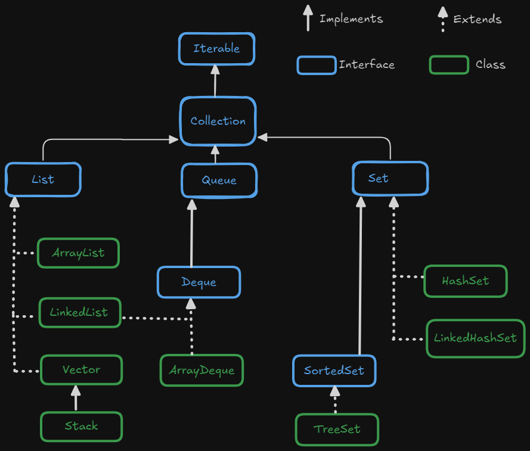

# Collections

* **Collection** represents group of individual objects as a single enitiy.

* **Collection Framework** : It contains several classes and interfaces which can be used to represent group of individual objects as single entity.

* **Collection Framework Interfaces and Classes**

    

    - *Collection (I)* : If we want to  represents group of individual objects as a single enitiy.

        - It defines most common methods which are applicable for any collection object.
        - In general collection interface is considered as root interface of collection framework.

    
    - Collection vs Collections
        * In Java, `Collection` and `Collections` are two distinct terms that are often confused.

| `Collection`                                      | `Collections`                                      |
|---------------------------------------------------|---------------------------------------------------|
|It is an Interface                                         |It is an Utility class                                      |
|Present in `java.util` package                                       |Present in `java.util` package                                      |
| Represents a group of individual objects (elements) | Provides utility methods for working with collection objects (e.g., sorting, searching) |
| The root interface for `List`, `Set`, `Queue`, etc. | Does not implement any interface (static methods only) |
| Defines methods for basic operations like `add()`, `remove()`, `size()` | Provides static methods like `sort()`, `reverse()`, `shuffle()`, `min()`, `max()` |
| Used to create a collection of objects (e.g., `List`, `Set`, etc.) | Used to perform operations on collections like sorting or searching |
| `Collection<String> list = new ArrayList<>();`    | `Collections.sort(list);`                         |

